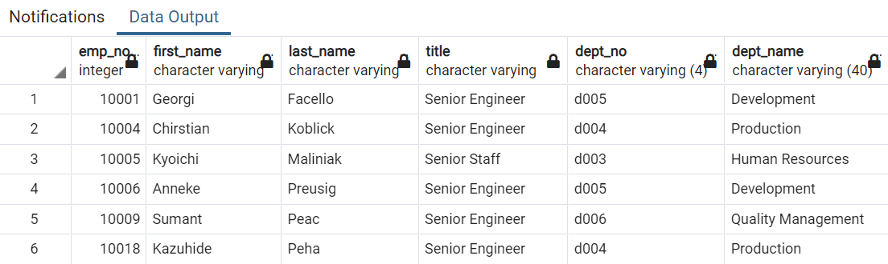

# Pewlett Hackard Analysis

## Project Overview

Pewlett Hackard is a large company that is expecting a large number of baby boomers to retire in the upcoming years.

Pewlett Hackard wants an estimate on how many employees could be retiring soon because they want to offer retiring packages, and because they need to know which positions they will need to replace in the near future.

### Purpose

The purpose of this analysis is to help Bob, the HR analyst, determine the number of retiring employees and their position titles, and identify employees who are eligible to participate in a mentorship program.

## Results

By using SQL in pgAdmin, we could determine the following:

1. At first, the total number of employees eligible to retire exceeded 133,000 employees. However, that number included some duplicates, which we removed using the `Distinct On` function in SQL. Click [here](Data/retirement_title.csv) to the link where the data can be downloaded.

2. When duplicates were removed, we identified 72,458 employees born between 1952 and 1955 that could potentially retire soon. Click [here](Data/unique_titles.csv) for the complete list. 

3. Out of those 72,458 employees, 25,916 (36%) currently work as Senior Engineers; 24,926 (34%) work as Senior Staff; 9,285 (13%) are Engineers; 7,636 (11%) are Staff; 3,603 (5%) are Technique Leaders; 1,090 (2%) are Assistant Engineers, and 2 (0%) are Managers. The table can be found by clicking [here](Data/retiring_titles.csv).

4. When looking at the Mentorship Eligibility list, we identified 1,549 employees. The complete list can be found [here](Data/mentorship_eligibility.csv).

## Summary

- How many roles will need to be filled as the "silver tsunami" begins to make an impact?

  We are estimating that more than 72,000 roles would have to be filled in the next 1 - 5 years. By running a different query, we were able to obtain more details about potential retirees, such us their department. This will provide more insight on what departments will need the most hires.

- Are there enough qualified, retirement-ready employees in the departments to mentor the next generation of Pewlett Hackard employees?

  There are almost 1,600 mentors. This does not seem enough to train the new generation of employees. From the below table, we can see that the Development and Production Department will need more hires, therefore more mentors.
  
  

Additional queries could be run. The company can modify the query to see how many employees could retire in the next year. That would allow the HR department to prioritize this group first.
